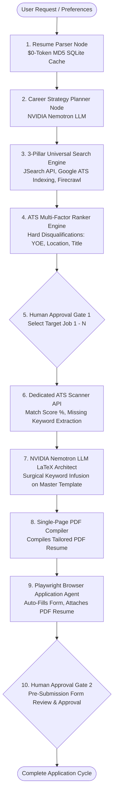

# 🚀 CareerOS: Autonomous Multi-Agent ATS Resume & Job Application Platform

<div align="center">


**An autonomous, multi-agent AI engineering platform that automates live job discovery, ATS gap analysis, surgical resume tailoring, and automated browser-based job application submission for everyone.**

</div>

---

## 🛠️ Tech Stack & Capabilities Grid

| Domain | Technologies Used | Core Responsibilities |
| :--- | :--- | :--- |
| **Agent Orchestration** | `LangGraph`, `StateGraph`, `AgentState` | Multi-agent state machine with human approval interrupt gates |
| **AI Core & LLM** | `NVIDIA Nemotron-3 LLM`, `NIM API`, `LangChain` | Career planning, intent routing & surgical LaTeX keyword infusion |
| **Browser Automation** | `Playwright` (Firefox & Chromium Engines) | Automated form detection, auto-filling, & PDF resume attachment |
| **Multi-Pillar Search** | `JSearch API`, `SerpAPI`, `Firecrawl Web Reader` | Platform-agnostic job discovery & full Job Description extraction |
| **ATS Match Analytics** | `RapidAPI ATS Scanner API` | Real-time ATS match scoring, missing skill extraction & gap reports |
| **Document Processing**| `LaTeX Compiler` (`pdflatex`/`xelatex`), `pdfplumber` | Single-page ATS-compliant PDF resume generation & raw text parsing |
| **Data & Caching** | `SQLite3`, `MD5 Cryptographic Hash` | $0-token resume caching, job deduplication & application logs |
| **Testing & Verification**| `Pytest`, `Standalone Test Runners` | Modular component testing & end-to-end verification |

---

## 🌟 Key Innovations & Technical Architecture

### 1. 🌐 3-Pillar Universal Job Search Architecture
Aggregates live job listings across 3 distinct search pillars with SQLite deduplication:
- **Pillar 1 (JSearch API `/search-v2`)**: Targeted job API queries filtered with `date_posted: week` and rate-limit controls.
- **Pillar 2 (SerpAPI Google Indexing)**: Direct company ATS application pages (`boards.greenhouse.io`, `jobs.lever.co`, `ashbyhq.com`) with `tbs: qdr:m` recency filters.
- **Pillar 3 (Firecrawl Web Scraper)**: Full raw Job Description extraction directly from company career portals.

### 2. 🤖 Fully Automated Job Application Submission (Playwright Browser Engine)
- Launches Playwright (Firefox Engine) with **0 profile lock conflicts**.
- Automatically navigates to the target apply URL, auto-detects form fields (*Name, Email, Phone, LinkedIn, GitHub*), and attaches your compiled **single-page ATS-tailored PDF resume**.
- Includes **Guided Human Handoff** and **Pre-Submission Review Interrupt (Gate 2)** for 100% application accuracy.

### 3. 🎨 NVIDIA Nemotron LLM Surgical LaTeX Architect
- Performs **Surgical Keyword Infusion**: Weaves missing ATS keywords into project bullet points and technical skills without fabricating fake experience or altering real dates/degrees.
- **0 Structural Breakage**: Preserves all custom LaTeX macros (`\resumeSubheading`, `\resumeProjectHeading`), margins, and single-page ATS layout formatting.

### 4. ⚡ $0-Token Smart MD5 Hash Resume Caching (< 1ms Execution)
- Computes an **MD5 cryptographic checksum** of candidate resume PDFs.
- Bypasses LLM re-parsing completely on unchanged resume uploads, retrieving structured candidate profiles instantly from SQLite DB in **< 1ms with 0 token consumption**.

### 5. 🛡️ Dual Human Approval Interrupt Gates
- **Gate 1 (Job Selection)**: Interactive terminal menu to select 1 target job from the ATS-sorted qualified feed.
- **Gate 2 (Pre-Submission Form Review)**: Playwright pauses live on screen with pre-filled fields and attached single-page PDF resume before submitting.

### 6. 📊 100% Pure Python ATS Ranking & Hard Disqualification Engine (< 10ms)
Executes deterministic hard disqualification rules **before** LLM invocation (0 LLM tokens, < 10ms speed):
- **YOE Gap Filtering**: Disqualifies roles requiring 2+ YOE for fresher candidates (`candidate_yoe <= 1`).
- **Seniority Filtering**: Disqualifies `Senior`, `Lead`, `Manager`, `Staff`, `Principal` titles.
- **Geographic Filtering**: Disqualifies foreign locations for India-based candidates unless global/worldwide remote is specified.
- **Recency Filtering**: Purges old or expired postings (>30 days).

---

## 📐 System Flowchart



---

## 📂 Project Structure

```text
career-os/
├── app/
│   ├── agents/
│   │   ├── parser.py       # Resume Parser Agent ($0-Token MD5 SQLite Cache)
│   │   ├── planner.py      # Career Strategy Planner Agent (NVIDIA Nemotron LLM)
│   │   ├── searcher.py     # 3-Pillar Universal Job Search Engine
│   │   ├── ranker.py       # Deterministic ATS Multi-Factor Ranking Engine
│   │   ├── latex_agent.py  # NVIDIA Nemotron LLM Surgical LaTeX Architect Agent
│   │   ├── compiler.py     # Single-Page PDF Resume Compiler Agent
│   │   └── browser.py      # Playwright Browser Application Agent
│   ├── config/
│   │   ├── settings.py     # Centralized Environment Configuration
│   │   └── model_factory.py # Model Factory (NVIDIA Nemotron LLM)
│   ├── graph/
│   │   ├── state.py        # Master AgentState TypedDict
│   │   └── workflow.py     # Master LangGraph Orchestration Graph
│   ├── schemas/
│   │   └── models.py       # Pydantic Data Models (CandidateProfile, UnifiedJobListing)
│   ├── services/
│   │   └── rapidapi_ats.py # Dedicated External ATS Scanner API Client
│   ├── templates/
│   │   └── jake.tex        # Master Jake's Resume Overleaf LaTeX Base Code
│   └── tracker/
│       └── db.py           # SQLite Tracker & MD5 Hash Deduplication Engine
├── tests/                  # Standalone Modular Test Suite
│   ├── test_full_resume_ats_api.py
│   ├── test_jakes_resume_latex.py
│   ├── test_browser_agent.py
│   ├── test_playwright_visual_demo.py
│   └── export_report.py
├── data/                   # 🔒 100% Gitignored (DB, uploads, compiled PDFs, outputs)
├── main.py                 # 🚀 Master Production Entrypoint CLI
├── .gitignore              # Privacy & Data Protection Ignore Rules
├── .env.example            # Environment Variable Template
└── requirements.txt        # Production Python Dependencies
```

---

## ⚡ Getting Started

### 1. Installation & Environment Setup
Clone the repository and set up a virtual environment:

```bash
git clone https://github.com/ARJUN-PUNDIR/career-os.git
cd career-os

python3 -m venv myenv
source myenv/bin/activate
pip install -r requirements.txt
playwright install firefox
```

### 2. Configure Environment Variables
Copy `.env.example` to `.env` and fill in your credentials:

```bash
cp .env.example .env
```

```env
NVIDIA_API_KEY=your_nvidia_nemotron_api_key
RAPIDAPI_KEY=your_rapidapi_key
SERPAPI_KEY=your_serpapi_key
FIRECRAWL_API_KEY=your_firecrawl_api_key
```

---

## 🚀 Usage

### Run Full Master Pipeline
Execute `main.py` for end-to-end execution:

```bash
python main.py
```

### Run Standalone Test Suite
Execute individual module test scripts inside `tests/`:

```bash
# Test Dedicated ATS Scanner API
python tests/test_full_resume_ats_api.py

# Test Surgical LaTeX Architect & PDF Compiler
python tests/test_jakes_resume_latex.py

# Test Playwright Browser Agent (Live Job Apply Page)
python tests/test_browser_agent.py

# Test Playwright Visual Demo
python tests/test_playwright_visual_demo.py

# Export SQLite Database Jobs to Markdown Report
python tests/export_report.py
```

---

## 📄 License
Distributed under the MIT License. See `LICENSE` for details.
