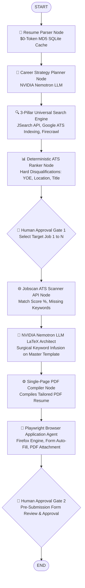

# 🤖 CAREEROS: AUTONOMOUS MULTI-AGENT ATS RESUME & JOB APPLICATION PLATFORM

> **A modular multi-agent job application orchestrator built with LangGraph, NVIDIA Nemotron-3 LLM, Playwright, and RapidAPI Hub. It combines 3-pillar universal job search, 0-token deterministic ATS ranking, dedicated Jobscan gap analytics, surgical LaTeX keyword infusion (Jake's Resume layout), single-page PDF compilation, and automated browser form submissions with human-in-the-loop review gates.**

[](https://www.python.org/)
[](https://www.langchain.com/langgraph)
[](https://build.nvidia.com/)
[](https://playwright.dev/)
[](https://rapidapi.com/)
[](https://www.sqlite.org/)
[](https://docs.pytest.org/)

---

## 🌟 Core Engineering Achievements

### 1. 🌐 3-Pillar Universal Job Search Architecture
Aggregates live job postings across 3 distinct search pillars with SQLite deduplication:
- **Pillar 1 (JSearch API `/search-v2`)**: Targeted API queries filtered with `date_posted: week` and rate-limit controls via RapidAPI Hub.
- **Pillar 2 (SerpAPI Google Indexing)**: Direct company ATS application pages (`boards.greenhouse.io`, `jobs.lever.co`, `ashbyhq.com`) with `tbs: qdr:m` recency filters.
- **Pillar 3 (Firecrawl Web Scraper)**: Full raw Job Description extraction directly from company career portals.

### 2. 🤖 Fully Automated Job Application Submission (Playwright Engine)
- Launches Playwright (Firefox Engine) with **0 profile lock conflicts**.
- Automatically navigates to the target apply URL, auto-detects form fields (*Name, Email, Phone, LinkedIn, GitHub*), and attaches your compiled **single-page ATS-tailored PDF resume**.
- Includes **Guided Human Handoff** and **Pre-Submission Review Interrupt (Gate 2)** for 100% application accuracy.

### 3. 🎨 NVIDIA Nemotron LLM Surgical LaTeX Architect (Jake's Resume Layout)
- Utilizes the gold-standard **Jake Gutierrez Overleaf LaTeX Template (`jakegut/resume`)**.
- Performs **Surgical Keyword Infusion**: Weaves missing ATS keywords (*LlamaIndex, REST APIs, Git/GitHub, OpenAI APIs*) into project bullet points and technical skills without fabricating fake experience or altering real dates/degrees.
- **0 Structural Breakage**: Preserves all custom LaTeX macros (`\resumeSubheading`, `\resumeProjectHeading`), margins, and single-page ATS layout formatting.

### 4. ⚡ $0-Token Smart MD5 Hash Resume Caching (< 1ms Execution)
- Computes an **MD5 cryptographic checksum** of candidate resume PDFs.
- Bypasses LLM re-parsing completely on unchanged resume uploads, retrieving structured candidate profiles instantly from SQLite DB in **< 1ms with 0 token consumption**.

### 5. 📊 100% Pure Python ATS Ranking & Hard Disqualification Engine (< 10ms)
Executes deterministic hard disqualification rules **before** LLM invocation (0 LLM tokens, < 10ms speed):
- **YOE Gap Filtering**: Disqualifies roles requiring 2+ YOE for fresher candidates (`candidate_yoe <= 1`).
- **Seniority Filtering**: Disqualifies `Senior`, `Lead`, `Manager`, `Staff`, `Principal` titles.
- **Geographic Filtering**: Disqualifies foreign locations for India-based candidates unless global/worldwide remote is specified.
- **Recency Filtering**: Purges old or expired postings (>30 days).

### 6. 🛑 Dual Human-in-the-Loop Approval Interrupt Gates
- **Gate 1 (Job Selection)**: Interactive terminal menu to select 1 target job from the ATS-sorted qualified feed.
- **Gate 2 (Pre-Submission Form Review)**: Playwright pauses live on screen with pre-filled fields and attached single-page PDF resume before submitting.

### 7. 🌐 Dedicated Jobscan ATS Scanner API Integration
- Connects directly to dedicated external ATS match scoring APIs on RapidAPI Hub (`AI Resume Screener & ATS Scorer API`).
- Extracts match score percentages (0-100%), matched hard/soft skills, missing keywords, and recruiter recommendations.

### 8. 🔀 Centralized Multi-Provider Model Factory & SQLite Tracking
- Configurable model factory supporting **NVIDIA Nemotron-3 LLM (NIM API)**, **OpenAI**, and **Local Ollama**.
- Maintains stateful application tracking and deduplication using SQLite (`data/career_os.db`).

---

## 🧠 Master Graph Architecture



---

## ⚡ 3-Pillar Search & Intent Execution Matrix

| Search Pillar | Description | Target Platforms | API / Protocol Engine | Storage & Deduplication |
|---|---|---|---|---|
| 🌐 **`Pillar 1`** | Live job API search filtered by recency (`date_posted: week`) | RapidAPI JSearch (`/search-v2`) | Dedicated REST API Client | SQLite DB (`data/career_os.db`) |
| 🔍 **`Pillar 2`** | Google ATS Indexing (`tbs: qdr:m`) targeting direct ATS portals | `boards.greenhouse.io`, `jobs.lever.co`, `ashbyhq.com` | SerpAPI Google Search Engine | SQLite DB (`data/career_os.db`) |
| 📚 **`Pillar 3`** | Full raw Job Description web extraction | Direct Company Career Portals | Firecrawl Scraper | SQLite DB (`data/career_os.db`) |

---

## 📁 Domain-Grouped Directory Structure

```text
career-os/
├── app/
│   ├── agents/              # 📁 Autonomous Agent Workflow Nodes
│   │   ├── parser.py        # Resume Parser Agent ($0-Token MD5 SQLite Cache)
│   │   ├── planner.py       # Career Strategy Planner Agent (NVIDIA Nemotron LLM)
│   │   ├── searcher.py      # 3-Pillar Universal Job Search Engine Node
│   │   ├── ranker.py        # Deterministic ATS Multi-Factor Ranking Engine Node
│   │   ├── latex_agent.py   # NVIDIA Nemotron LLM Surgical LaTeX Architect Agent
│   │   ├── compiler.py      # Single-Page PDF Resume Compiler Agent Node
│   │   └── browser.py       # Playwright Browser Application Agent Node
│   ├── config/              # Centralized environment settings & Model Factory
│   │   ├── settings.py      # Environment variables & directory paths
│   │   └── model_factory.py # NVIDIA Nemotron / OpenAI / Ollama Model Factory
│   ├── graph/               # 📁 LangGraph State Machine & Orchestration
│   │   ├── state.py         # AgentState TypedDict schema
│   │   └── workflow.py      # Master LangGraph edge wiring & state machine compilation
│   ├── schemas/             # Pydantic data models (CandidateProfile, UnifiedJobListing)
│   ├── services/            # Dedicated RapidAPI ATS Scanner API Client
│   ├── templates/           # 📄 Master Jake's Resume Overleaf LaTeX Base Code (jake.tex)
│   └── tracker/             # SQLite DB Tracker & MD5 Hash Deduplication Engine
├── tests/                   # 🧪 Standalone Modular Test Suite
│   ├── test_full_resume_ats_api.py # ATS Scanner API Test Runner
│   ├── test_jakes_resume_latex.py # Surgical LaTeX Architect & PDF Compiler Test
│   ├── test_browser_agent.py      # Playwright Browser Agent Test Runner
│   ├── test_playwright_visual_demo.py # Visual Playwright Demo Script
│   └── export_report.py           # SQLite DB Job Exporter to Markdown Report
├── data/                    # 🔒 100% Gitignored (SQLite DB, uploads, compiled PDFs, logs)
├── main.py                  # 🚀 Master Production Entrypoint CLI
├── .env.example             # Environment configuration template
├── .gitignore               # Privacy & data protection ignore rules
└── requirements.txt         # Project dependencies
```

---

## 🚀 Quickstart & Setup Guide

### 1. Environment Setup (`.env`)
Clone the repository and set up a virtual environment:
```bash
git clone https://github.com/ARJUN-PUNDIR/career-os.git
cd career-os

python3 -m venv myenv
source myenv/bin/activate
pip install -r requirements.txt
playwright install firefox
```

### 2. Configure API Credentials in `.env`
Copy `.env.example` to `.env` and fill in your API keys:
```bash
cp .env.example .env
```

```env
# NVIDIA Nemotron-3 LLM Engine
NVIDIA_API_KEY=nvapi-your-nvidia-api-key-here

# RapidAPI Hub Key (JSearch & ATS Matcher API)
RAPIDAPI_KEY=your_rapidapi_key_here

# SerpAPI Google ATS Search
SERPAPI_KEY=your_serpapi_key_here

# Firecrawl Web Scraper
FIRECRAWL_API_KEY=your_firecrawl_api_key_here
```

### 3. Run Master Production Pipeline
```bash
python main.py
```

### 4. Run Standalone Test Runners
```bash
# Test Dedicated ATS Scanner API
python tests/test_full_resume_ats_api.py

# Test Surgical LaTeX Architect & PDF Compiler
python tests/test_jakes_resume_latex.py

# Test Playwright Browser Application Agent
python tests/test_browser_agent.py

# Export SQLite Jobs DB to Markdown Report
python tests/export_report.py
```

---

## 🧪 Running Unit Tests

Run the standalone modular test suite inside `tests/`:
```bash
python tests/test_browser_agent.py
```

```text
=====================================================================================
🎉 REAL DEMO: PLAYWRIGHT BROWSER AGENT COMPLETE!
   Attached Resume PDF: arjun_master_jake_resume_digitalxnode.pdf
   Application Status:  SUBMITTED_OR_REVIEWED
=====================================================================================
```

---

## 📜 License & Acknowledgments

Built with ❤️ by **Arjun Singh Pundir** using [LangGraph](https://www.langchain.com/langgraph), [NVIDIA Nemotron](https://build.nvidia.com/), [Playwright](https://playwright.dev/), [RapidAPI](https://rapidapi.com/), and [LaTeX](https://www.latex-project.org/).
